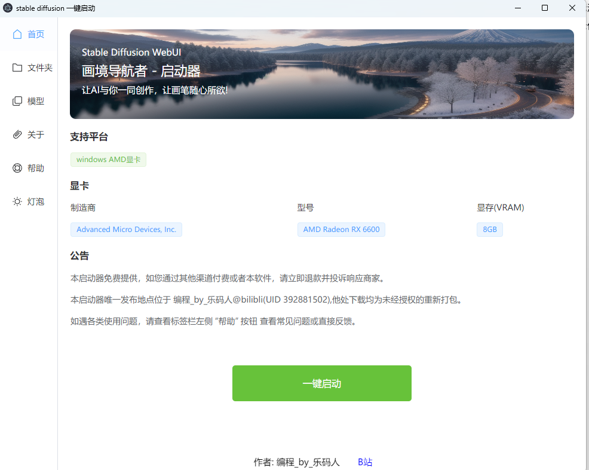
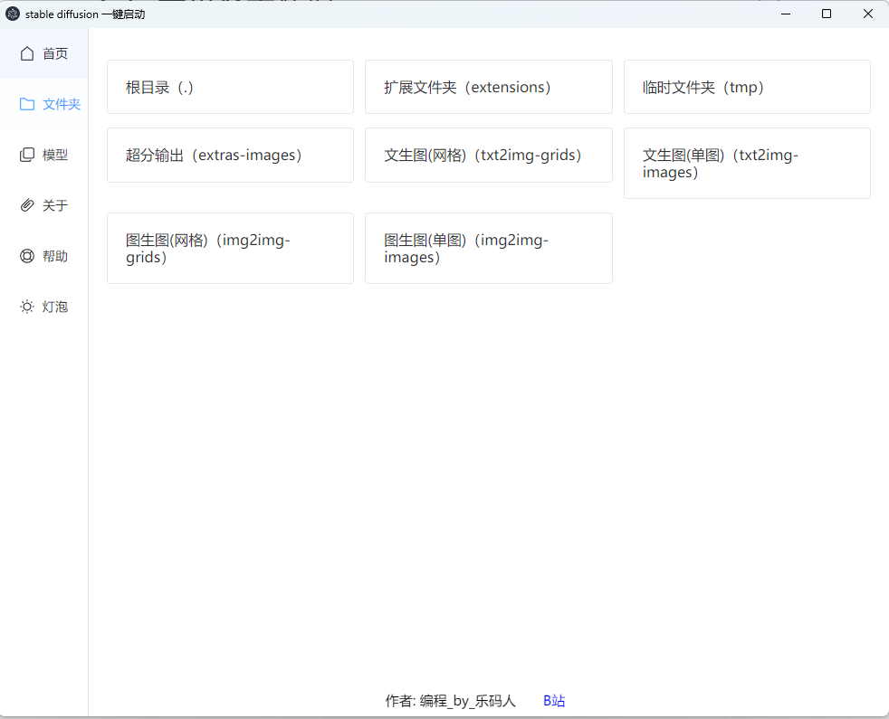
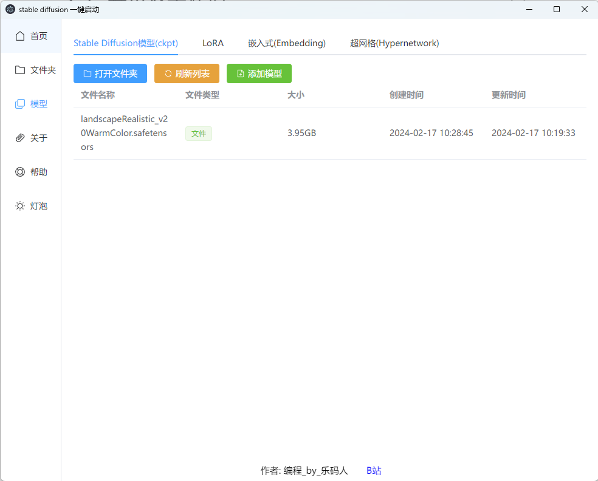
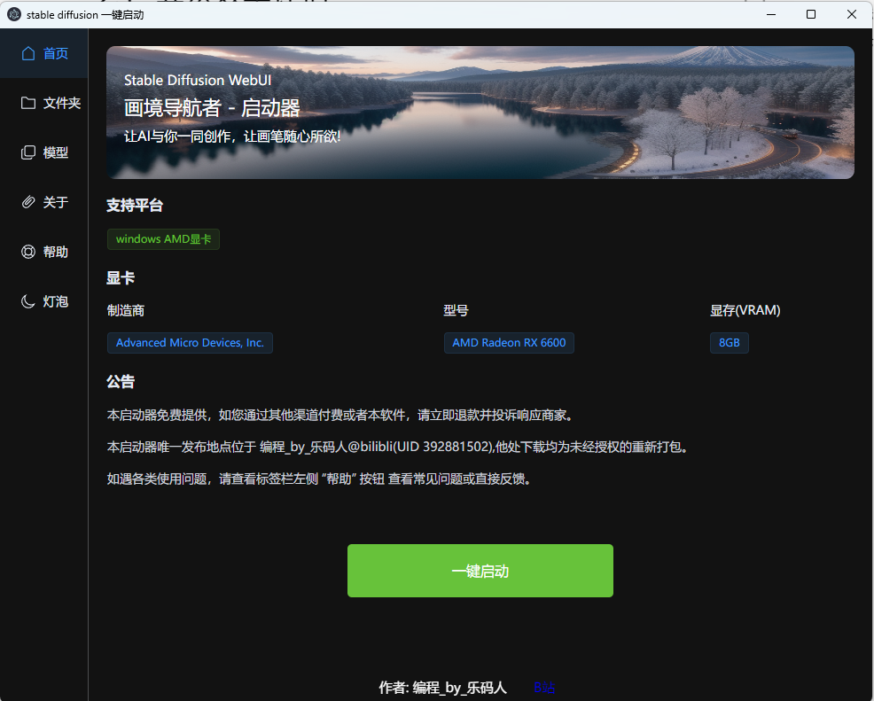

# 前言
- 使用vue3 vite electron element-plus构建，正好学习下electron

# 简介

- stable-diffusion “画境导航者” 启动器
- 支持功能
    - 一键启动
    - 打开文件夹（tmp、txt2img-images）等
    - 模型所在文件夹（ckpt、LORA、Embedding、Hupernetwork）
        - 打开文件夹
        - 刷新列表
        - 添加模型
    - 暗黑主题
    - 显卡型号识别

# 目录

- `stable-diffusion-electron` electron代码
- `stable-diffusion-webui-directml` stable-diffusion windows启动脚本
    - webui-directml
        - [适用于AMD的仓库 stable-diffusion-webui-directml](https://github.com/lshqqytiger/stable-diffusion-webui-directml)
    - 可以直接双击 `run-directml.bat` 直接启动，效果等同启动器的“一键启动”

# 测试设备

- AMD Radeon RX 6600

# 开发

- 进入`stable-diffusion-electron`目录
- 安装依赖 `yarn install`
- 运行 `npm run dev`
- 打包 `npm run make`

# 效果
- 
- 
- 
- 